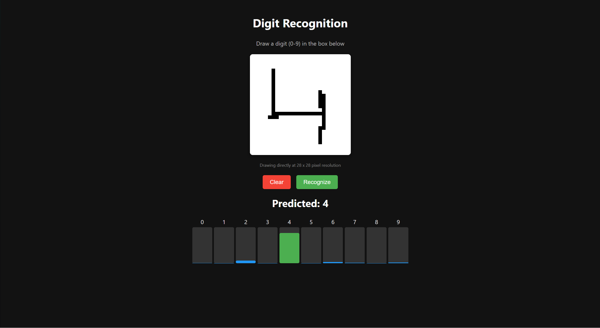

# PixelPredict

[](https://www.python.org/downloads/)
[](https://flask.palletsprojects.com/)
[](https://numpy.org/)
[](LICENSE)
[](https://number-id.onrender.com/)
[](http://yann.lecun.com/exdb/mnist/)

<div>
  
  
</div>

> PixelPredict is a web-based handwritten digit recognition application powered by a custom-built neural network, trained on the MNIST dataset. Draw digits and watch AI predict them in real-time! 

## Demo

Try the live demo at [https://number-id.onrender.com/](https://number-id.onrender.com/)



## Features

* **Custom Neural Network**: Handcrafted two-layer feedforward neural network with \~97% test accuracy
* **Interactive Canvas**: User-friendly 28×28 drawing surface (scaled to 280×280 pixels)
* **Real-time Visualization**: Dynamic confidence score visualization with bar charts
* **Touch Support**: Works on both desktop and mobile devices
* **Fast Response**: Real-time prediction through optimized Flask backend
* **Training Insights**: Includes visualization tools for model performance analysis

## Neural Network Architecture

PixelPredict uses a custom neural network implemented from scratch with NumPy:

```
Input Layer (784 nodes) → Hidden Layer (128 nodes, ReLU) → Output Layer (10 nodes, Softmax)
```

### Technical Details

| Component         | Specification                                    |
| ----------------- | ------------------------------------------------ |
| **Input**         | 28×28 grayscale images (flattened to 784 values) |
| **Hidden Layer**  | 128 neurons with ReLU activation                 |
| **Output Layer**  | 10 neurons with Softmax activation               |
| **Parameters**    | \~101K trainable parameters                      |
| **Loss Function** | Cross-entropy                                    |
| **Optimization**  | Mini-batch gradient descent                      |
| **Weight Init**   | He initialization                                |
| **Training**      | 20 epochs, batch size 64, learning rate 0.01     |
| **Performance**   | 97-98% training accuracy, 95-97% test accuracy   |

## Project Structure

```
PixelPredict/
├── app.py               # Flask app with neural network inference
├── neural_training.py   # Neural network training script
├── visualization.py     # Training visualization tools
├── index.html           # Frontend interface
├── requirements.txt     # Python dependencies
├── data/                # MNIST dataset files
│   ├── train-images.idx3-ubyte
│   ├── train-labels.idx1-ubyte
│   ├── t10k-images.idx3-ubyte
│   └── t10k-labels.idx1-ubyte
├── W1.npy               # Hidden layer weights
├── b1.npy               # Hidden layer biases
├── W2.npy               # Output layer weights
├── b2.npy               # Output layer biases
└── history.npy          # Training metrics history
```

## Installation

### Prerequisites

* Python 3.7+
* pip (Python package manager)

### Setup

1. **Clone the repository**

   ```bash
   git clone https://github.com/your-username/pixelpredict.git
   cd pixelpredict
   ```

2. **Create and activate virtual environment**

   ```bash
   # Linux/macOS
   python -m venv venv
   source venv/bin/activate

   # Windows
   python -m venv venv
   venv\Scripts\activate
   ```

3. **Install dependencies**

   ```bash
   pip install -r requirements.txt
   pip install matplotlib  # For visualization.py
   ```

4. **Download MNIST dataset**

   Download from [http://yann.lecun.com/exdb/mnist/](http://yann.lecun.com/exdb/mnist/) and place in `data/` directory:

   ```
   data/
   ├── train-images.idx3-ubyte
   ├── train-labels.idx1-ubyte
   ├── t10k-images.idx3-ubyte
   └── t10k-labels.idx1-ubyte
   ```

5. **Train the network (optional)**

   ```bash
   python neural_training.py
   ```

6. **Run the application**

   ```bash
   python app.py
   ```

7. **Access the application**

   Open your browser and navigate to [http://localhost:5000](http://localhost:5000)

## Usage

1. **Draw a digit** (0-9) on the canvas using your mouse or touch device
2. Click **Recognize** to see the prediction
3. View the **confidence scores** for each possible digit
4. Click **Clear** to reset and try again
5. **Visualize training metrics** (if you've run the training):

   ```bash
   python visualization.py
   ```

## Model Performance


The neural network achieves:

* **Training accuracy**: 97-98%
* **Test accuracy**: 95-97%
* **Loss convergence**: \~0.1-0.2 on test set

## Deployment

PixelPredict is deployed on Render. To deploy your own instance:

1. **Push to GitHub** including all weight files
2. **Set up on Render**:

   * Create a new Web Service
   * Connect your GitHub repository
   * Set build command: `pip install -r requirements.txt`
   * Set start command: `gunicorn app:app`

## Dependencies

| Library        | Purpose                           |
| -------------- | --------------------------------- |
| **NumPy**      | Neural network computations       |
| **Flask**      | Web server                        |
| **Pillow**     | Image preprocessing               |
| **Gunicorn**   | Production deployment             |
| **Matplotlib** | Training visualization (optional) |

## Contributing

Contributions are welcome! Here's how you can contribute:

1. **Fork** the repository
2. **Create** a feature branch:

   ```bash
   git checkout -b feature/amazing-feature
   ```
3. **Commit** your changes:

   ```bash
   git commit -m 'Add an amazing feature'
   ```
4. **Push** to your branch:

   ```bash
   git push origin feature/amazing-feature
   ```
5. **Submit** a Pull Request

## License
This project is licensed under the MIT License - see the [LICENSE](LICENSE) file for details.

## Acknowledgments

* **MNIST Dataset**: Yann LeCun and Corinna Cortes - [http://yann.lecun.com/exdb/mnist/](http://yann.lecun.com/exdb/mnist/)
* **Deployment**: Render - [https://render.com/](https://render.com/)
* **Stack**: Flask, NumPy, JavaScript, and HTML5 Canvas
